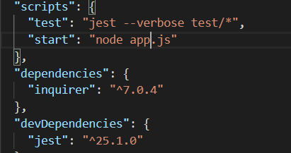

# Template-Engine-Employee-Summary

This project is a Software engineering team generator command line application. The application will prompt the user for information about the team manager and then information about the team members. The user can input any number of team members, and they may be a mix of engineers and interns. When the user has completed building the team, the application will create an HTML file that displays a nicely formatted team roster based on the information provided by the user

* Note: A test using 'jest' is used to ensure that all unit tests pass.

## User Story

As a manager
I want to generate a webpage that displays my team's basic info
so that I have quick access to emails and GitHub profiles

## Install

* npm install
* npm i
* npm install --save-dev jest
* npm init

Dependencies: 

## Run

To run the application just type:
* node app.js

## Testing

* npm run test - will run a test using jest

## Demo

* <a href="https://drive.google.com/file/d/1yO4M8pAAFzpijVdGRg2FCFMybQKnfhEi/view" target="_blank">Click here to view demo (how the application works).

* <a href="https://drive.google.com/file/d/1rbCwtQyPx8E8FPXA1ThWzy1CL84BIBun/view" target="_blank">Click here to view 'npm runt test' demo</a>

## License
This project is licensed under the MIT License - see the LICENSE.md file for details
